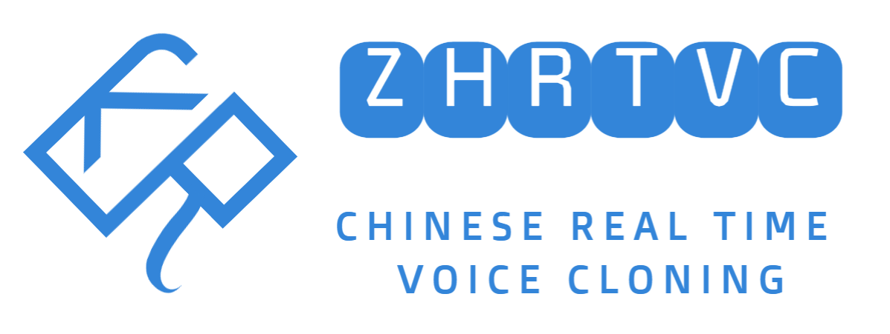
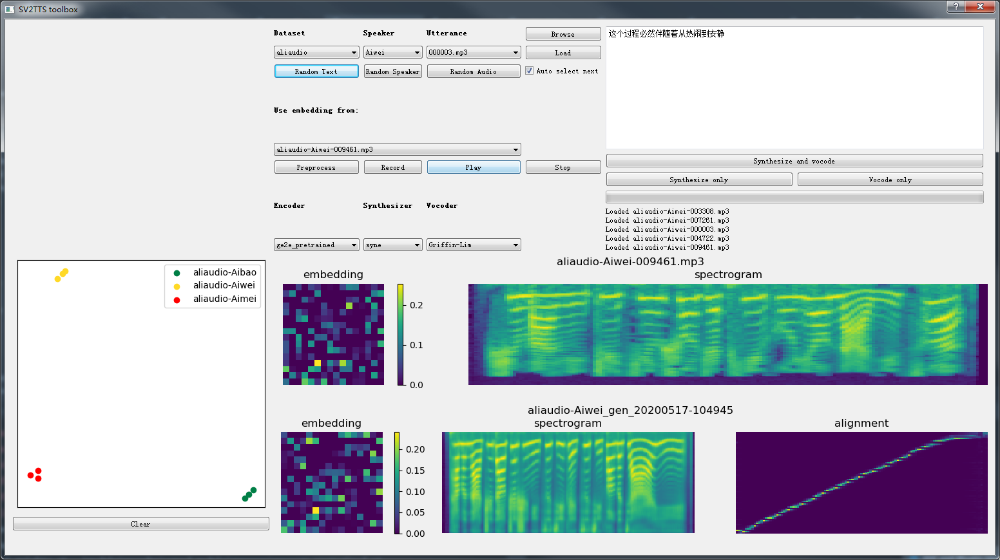

# zhrtvc
Chinese Real Time Voice Cloning

tips: 中文或汉语的语言缩写简称是**zh**。

关注【**啊啦嘻哈**】微信公众号，回复一个字【**听**】，小萝莉有话对你说哦^v^

### 版本

v1.1.5

使用说明和注意事项详见[readme](zhrtvc/README.md)

tips: 需要进入zhrtvc项目的代码子目录【zhrtvc】运行代码。

+ **原始语音和克隆语音对比样例**

链接: https://pan.baidu.com/s/1TQwgzEIxD2VBrVZKCblN1g 

提取码: 8ucd

+ **中文语音语料**

中文语音语料[zhvoice](https://github.com/KuangDD/zhvoice)，语音更加清晰自然，包含8个开源数据集，3200个说话人，900小时语音，1300万字。

zhvoice语料可用于训练语音克隆的基础模型。

+ **中文语音语料训练的语音合成器模型**

name: logs-synx.zip

[智浪淘沙](https://github.com/zhilangtaosha)训练和分享。

用中文的文本语音平行语料zhvoice训练得到的语音合成器模型。

链接: https://pan.baidu.com/s/1ovtu1n3eF7y0JzSxstQC7w

提取码: f4jx

+ **中文开源语音训练的语音编码器模型**

name: ge2e_pretrained_iwater.pt

[iwater](https://github.com/iwater)训练和分享。

用中文开源语音语料训练的语音编码器模型。

链接: https://pan.baidu.com/s/1-5r_YXQOg2vZnuEh1Slxaw

提取码:19kh

+ **toolbox**

+ **合成样例**

[aliaudio-Aibao-004113.wav](files/aliaudio-Aibao-004113.wav)

[aliaudio-Aimei-007261.wav](files/aliaudio-Aimei-007261.wav)

[aliaudio-Aina-000819.wav](files/aliaudio-Aina-000819.wav)

[aliaudio-Aiqi-009619.wav](files/aliaudio-Aiqi-009619.wav)

[aliaudio-Aitong-003149.wav](files/aliaudio-Aitong-003149.wav)

[aliaudio-Aiwei-009461.wav](files/aliaudio-Aiwei-009461.wav)

+ **注意**

跑提供的模型建议用Griffin-Lim声码器，目前MelGAN和WaveRNN没有完全适配。

### 目录介绍

#### zhrtvc
代码，包括encoder、synthesizer、vocoder、toolbox模块，包括模型训练的模块和可视化合成语音的模块。

执行脚本需要进入zhrtvc目录操作。

代码相关的说明详见zhrtvc目录下的[readme](zhrtvc/README.md)文件。

#### models
预训练的模型，包括encoder、synthesizer、vocoder的模型。

预训练的模型在百度网盘下载，下载后解压，替换models文件夹即可。

+ **样本模型**

链接：https://pan.baidu.com/s/14hmJW7sY5PYYcCFAbqV0Kw 

提取码：zl9i

#### data
语料样例，包括语音和文本对齐语料，处理好的用于训练synthesizer的数据样例。

可以直接执行`synthesizer_preprocess_audio.py`和`synthesizer_preprocess_embeds.py`把samples的语音文本对齐语料转为SV2TTS的用于训练synthesizer的数据。

语料样例在百度网盘下载，下载后解压，替换data文件夹即可。

+ **样本数据**

链接：https://pan.baidu.com/s/1Q_WUrmb7MW_6zQSPqhX9Vw 

提取码：bivr

**注意：** 该语料样例用于测试跑通模型，数据量太少，不可能使得模型收敛，即不会训练出可用模型。在测试跑通模型情况下，处理自己的数据为语料样例的格式，用自己的数据训练模型即可。

### 学习交流

【AI解决方案交流群】QQ群：925294583

点击链接加入群聊：https://jq.qq.com/?_wv=1027&k=wlQzvT0N

### Real-Time Voice Cloning
This repository is an implementation of [Transfer Learning from Speaker Verification to
Multispeaker Text-To-Speech Synthesis](https://arxiv.org/pdf/1806.04558.pdf) (SV2TTS) with a vocoder that works in real-time. Feel free to check [my thesis](https://matheo.uliege.be/handle/2268.2/6801) if you're curious or if you're looking for info I haven't documented yet (don't hesitate to make an issue for that too). Mostly I would recommend giving a quick look to the figures beyond the introduction.

SV2TTS is a three-stage deep learning framework that allows to create a numerical representation of a voice from a few seconds of audio, and to use it to condition a text-to-speech model trained to generalize to new voices.

### Papers implemented  
| URL | Designation | Title | Implementation source |
| --- | ----------- | ----- | --------------------- |
|[**1806.04558**](https://arxiv.org/pdf/1806.04558.pdf) | **SV2TTS** | **Transfer Learning from Speaker Verification to Multispeaker Text-To-Speech Synthesis** | This repo |
|[1802.08435](https://arxiv.org/pdf/1802.08435.pdf) | WaveRNN (vocoder) | Efficient Neural Audio Synthesis | [fatchord/WaveRNN](https://github.com/fatchord/WaveRNN) |
|[1712.05884](https://arxiv.org/pdf/1712.05884.pdf) | Tacotron 2 (synthesizer) | Natural TTS Synthesis by Conditioning Wavenet on Mel Spectrogram Predictions | [Rayhane-mamah/Tacotron-2](https://github.com/Rayhane-mamah/Tacotron-2)
|[1710.10467](https://arxiv.org/pdf/1710.10467.pdf) | GE2E (encoder)| Generalized End-To-End Loss for Speaker Verification | This repo |
